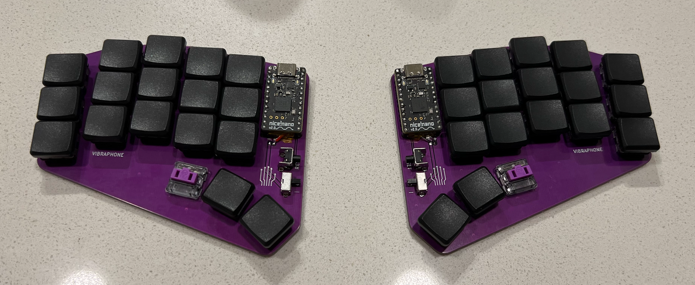
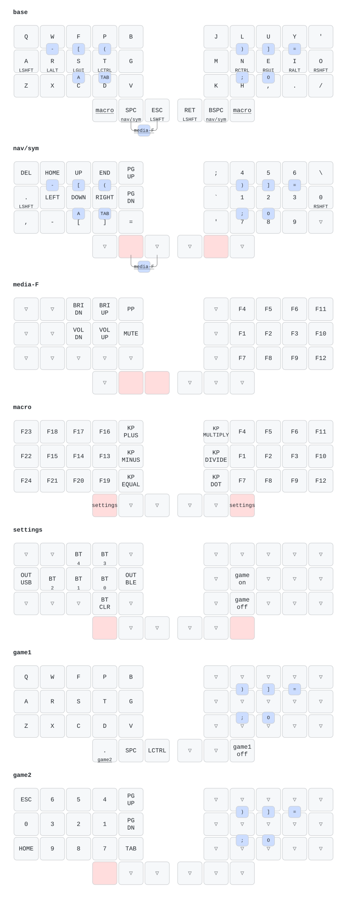

# Gerry's Keyboards

I enjoy, use, and rely on custom, ergonomic, programmable keyboards. Welcome to
a glimpse of my madness.

## Vibraphone



It's called Vibraphone because:
- I'm a percussionist. 🥁
- A vibraphone is a *keyboard instrument*.
- It has fewer keys than The Marimba*.
- It is flat, unlike The Marimba.

<sub>* more about The Marimba later.</sub>

The Vibraphone is my daily driver keyboard and also acts as my core, reference
keymap. It runs on [ZMK Firmware](https://zmk.dev/) and is a no-nonsense,
serious keyboard, heavily customized for my keyboard-centric workflow. All of my
other keyboards use the Vibraphone keymap as their base layer.

The PCB was designed by [Cyboard](https://www.cyboard.digital/) based on scans
of my hands and several iterations of printed mockups. The PCB features zero
diodes and hard-soldered keys for maximum durability. It can be thrown caseless
into a bag without any worry. The reset buttons and power toggle switches are
guarded by the PCB to reduce accidental operation, too.

One neat thing about this design is the non-uniform lateral spacing. This is to
minimize vertical movement effort without cramping fingers too close to each
other. Horizontally, keys are spaced apart to separate each finger, but the
index finger cluster is tighly spaced to reduce lateral motion. Otherwise, the
keys are as close to each other vertically as possible. The net effect is that I
can type without moving my hands and arms; only my digits move while my palms
are completely planted.

The combination of PCB layout and keymap **completely eliminates tucking a
thumb** under my palm while typing. That is a painful movement for me, so
eliminating it was a design goal.

The Vibraphone keymap is actually for 34 keys. The two extra thumb keys are
intentionally out of the way and are only used for non-typing functions. There
will eventually be a revision that eliminates these keys.

The Vibraphone is actually based on another custom keyboard I no longer use:
**The Marimba**. It's almost identical, except the Marimba was a bit larger, had
more keys, and wasn't flat.

#### Goals
- Purple: _the best color_
- Minimal, low effort movement
- Portable
- Durable: designed for reasonable wear and tear
- Fits on top of a laptop keyboard
- Wireless (Bluetooth)
- Support multiple devices concurrently (up to 5)
- Optional support for wired interface over USB-C
- No thumb tucking while typing

#### Keymap

The premise behind this keymap is staying in the home position as much as
possible in combination with everything else being within **1 DFH (Distance From
Home)**, and all flow-state happens on two layers. I very rarely use any layers
other than the `base` layer and the `nav/sym` layer. **Roughly 99% of all inputs
happen on these two layers and about 85% of all inputs happen in the home
position.** Note that the home position for a thumb is the middle button in the
thumb arch right next to the key intentionally missing the key cap.

The `base` layer is essentially
[Colemak-DHm](https://colemakmods.github.io/mod-dh/) for the alphabet, which is
an optimization over standard Colemak that reduces same-finger-bigrams and
lateral motion of the index fingers. Additionally, there are some combos to
access frequently used things from other layers. Brackets, parenthesis, tabs,
and semicolons are accessible via easy to use combos that are either 0 DFH or
0.5 DFH. **For an alphabet layer, Colemak-DHm places about 75% of typing inputs
on the home row, whereas QWERTY is only 30%.**

The `nav/sym` layer places 75% of the arrow cluster under the left hand's home
position, making an "upside down T" shape with the arrows to mimic popular
gaming controls ("WASD-like" arrows, only moved over to the right by one
position and into the home position). This is often a topic of contention with
Vim users who loudly object to using anything other than the `HJKL` keys. My
answers those objections are:
- `HJKL` only works in Vim, and even then, only in normal mode. My arrows work
  _everywhere_ in _every_ mode.
- To get its advantages, `HJKL` locks you into QWERTY or a QWERTY-like alphabet
  layout, which is abysmally inefficient compared to almost any other modern
  layout (see previously mentioned statistics). 
- `HJKL` is _also_ 75% in the home position (on a QWERTY layout), except it
  requires lateral finger movement (higher strain) from my second smallest
  finger, whereas my arrow cluster requires vertical movement (lower strain)
  from my longest finger.

The numpad is also nonstandard, intentionally placing the `1`, `2`, `3`, `0`
digits in the home position, in that order from left to right, on the right
hand. These are the most frequently used digits and symbols. The `nav/sym` layer
is enabled by holding either thumb's home position down, where the right-thumb
is the primary key because on tap because it's a backspace, which does not
require rolling to resolve as a tap. The left thumb's home position is the space
key, which must resolve as a tap during a roll, so it's the secondary and seldom
used way to activate the `nav/sym` layer due to its latency tradeoff.

All the other layers are very much out of the way and don't really get used
during normal typing situations. You'll notice that the `macro` layer is
accessed via the intentionally-out-of-the-way thumb keys, and to access the
`settings` layer, both intentionally-out-of-the-way thumb keys must be held. I
like to think of these keys as my "start" and "select" buttons, similar to some
older gaming controllers, since they're useful but rarely used and you don't
want to press them accidentally.

**You might notice that my shift keys are weird and I have weird combos for "A"
and "O".** Shifting is quite a rabbit hole that is full of tradeoffs. My keymap
opts for multi-function modifier keys on the home row. For non-shift modifiers
(`meta/gui/windows` key, `ctrl`, `alt`), this is quite natural and easy,
especially once you learn to do cross-hand chords (e.g. use right-side `ctrl`
with left-side `c` to copy). But shifting tends to favor rolling. This means
there is lots of tweaking for roll/tap resolution timing for my main shift keys,
my pinkies in the home row. It also means that IF I WANT TO TYPE IN ALL CAPS, I
have to alternate my pinkies every time I type an "A" or "O". I have two ways
around that: alternative shift keys (thumbs 1 position away from home) and
alternative "A" and "O" via a combo. Typing in all caps is very rare and this
hardly ever gets in the way.

The gaming layers essentially just disable multi-function keys to eliminate
latency. Gaming on this keyboard can be a challenge due to the limited number of
keys, but most modern games are optimized for hand-held controllers, and those
controls do tend to translate well to a minimal keyboard like my Vibraphone. I'm
also not a competitive gamer and don't mind compromising here. Now that I'm
older, I tend to prefer using a controller anyway because I can hand out on the
couch with my wife and cat. This keyboard _can_ game, but gaming is a non-goal.

Here's a generated diagram of the keymap, courtesy of [the keymap-drawer
project](https://github.com/caksoylar/keymap-drawer):

<picture>
  <source media="(prefers-color-scheme: dark)" srcset="img/keymap-dark.svg">
  
</picture>

## Note to future self

At this time, I don't really intend on other people using my bespoke keyboard,
so I don't care to make this user-friendly. But here are some notes for my
future self before I forget how to use this repo again, which has already
happened:

You need [Nix](https://nixos.org/download/) with flakes enabled. Then:

```sh
git clone https://github.com/gplusplus314/gkey.git
cd gkey
nix run .#flash -- left    # build + flash left half
nix run .#flash -- right   # right half
nix run .#flash            # both halves, in sequence
nix run .#flash-reset      # clear ZMK settings (prompts to confirm)
nix run .#update           # bump the pinned ZMK / Zephyr / HAL versions
nix run .#diagram          # redraw the keymap images below
```

Flashing is Linux-only (zmk-nix uses udisks). On macOS, do a `nix build
.#firmware` and copy the `.uf2` file to the bootloader by hand.
